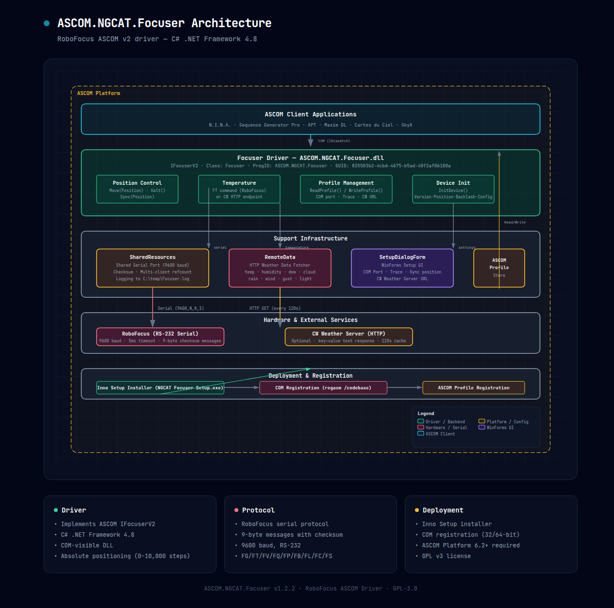

# ASCOM.NGCAT.Focuser

RoboFocus controller through ASCOM — a custom `IFocuserV2` driver for the RoboFocus serial protocol.

Having a RoboFocus, I ran into a few problems with the various drivers I could find:

- v1 drivers didn't have access to temperature.
- v3 drivers have temperature but don't save settings well and are a bit unstable.

Lack of development from the manufacturer for many years means the focuser is abandoned. So I found old documentation that mentions the protocol and implemented my own.

## Architecture

The driver implements the ASCOM `IFocuserV2` interface as a COM-visible .NET assembly (C#, .NET Framework 4.8). It talks to the RoboFocus over RS-232 serial at 9600 baud with 9-byte checksummed messages. Temperature can be read either from the focuser itself or from a weather server (via an optional CW HTTP endpoint providing cloud, temperature, humidity, dew point, etc.).

*Interactive HTML version: [`architecture.html`](architecture.html)*

## Protocol

The RoboFocus serial commands are:

| Command | Direction | Description |
| ------- | --------- | ----------- |
| `FG` | ↕ | Get current position / Set target position |
| `FT` | ↕ | Get temperature (raw ADC steps) |
| `FV` | ↕ | Get firmware version / Start ADC reading |
| `FQ` | ↓ | Stop motion (emergency halt) |
| `FP` | ↕ | Power module status |
| `FB` | ↕ | Backlash compensation (mode + amount) |
| `FL` | ↕ | Maximum travel limit |
| `FC` | ↕ | Configuration (duty cycle, step delay, step size) |
| `FS` | ↕ | Sync position (set current position counter) |

Messages are 9 bytes: 2-byte command + 6-byte payload + 1-byte checksum (sum of ASCII values mod 256). Responses begin with `F` (+ a two-letter command code) followed by 6 numeric bytes.

## Features

- **Absolute positioning** — position range 0 to 10,000 steps, maximum 10,000 steps per single move
- **Temperature reading** — from the focuser directly, or optionally from a remote weather server if a CW URL is configured
- **Temperature compensation** — not implemented (the RoboFocus hardware doesn't support it natively)
- **Multi-client serial** — shared serial port with reference counting, so multiple ASCOM clients can connect without fighting over the port
- **Position sync** — manually set the current position counter from the setup dialog
- **Tracing** — file-based logging to `C:\temp\Focuser.log` (enable via setup dialog)
- **Inno Setup installer** — 32/64-bit COM registration via `regasm /codebase`

## Setup

1. Install [ASCOM Platform 6.2](https://ascom-standards.org/) or later.
2. Run [`NGCAT Focuser Setup.exe`](NGCAT%20Focuser%20Setup.exe).
3. In your ASCOM astronomy software, select "ASCOM NGCAT Driver for Focuser" from the Chooser.
4. Configure the COM port (and optionally a CW weather server URL) in the setup dialog.

## Requirements

- Windows (COM / .NET Framework 4.8)
- ASCOM Platform 6.2+
- RoboFocus unit connected via RS-232 serial
- The CW weather server is optional — only needed if you want weather-based temperature readings

## Sources

- https://github.com/indilib/indi/blob/master/drivers/focuser/robofocus.cpp
- https://github.com/jbrazio/ardufocus-ascom

## License

GPLv3 — see [LICENSE](LICENSE).

No support, no guarantees. This project is only here to help those who want to build their own driver.
